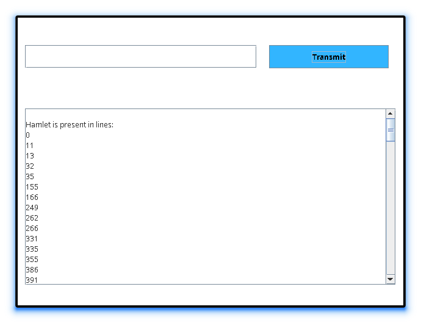

<div align = "center">

<h1><a href="https://2kabhishek.github.io/wordsearcher">WordSearcher</a></h1>

<a href="https://github.com/2KAbhishek/WordSearcher/blob/main/LICENSE">
 </a>

<a href="https://github.com/2KAbhishek/WordSearcher/graphs/contributors">
 </a>

<a href="https://github.com/2KAbhishek/WordSearcher/stargazers">
</a>

<a href="https://github.com/2KAbhishek/WordSearcher/network/members">
 </a>

<a href="https://github.com/2KAbhishek/WordSearcher/watchers">
 </a>

<a href="https://github.com/2KAbhishek/WordSearcher/pulse">
 </a>

<h3>Word searching with JavaFX 🔤🔍</h3>

<figure>
  
  <br/>
  <figcaption>wordsearcher screenshot</figcaption>
</figure>

</div>

## What is this

WordSearcher is a GUI tool that lets you searcg words in a file.

## Inspiration

Wanted to explore JavaFX.

## Prerequisites

Before you begin, ensure you have met the following requirements:

- You have installed the latest version of `JavaFX`

## Getting wordsearcher

To install wordsearcher, follow these steps:

```bash
git clone https://github.com/2kabhishek/wordsearcher
cd wordsearcher
```

## Using wordsearcher

Run the server first and then the client to open the application.

## How it was built

wordsearcher was built using `VS Code` and `JavaFX`.

## Challenges faced

Running the server and client was tricky sometimes.

## What I learned

- Learned about Server and Client side communication.
- Explored JavaFX.

Hit the ⭐ button if you found this useful.

## More Info

<div align="center">

<a href="https://github.com/2KAbhishek/wordsearcher">Source</a> | <a href="https://2kabhishek.github.io/wordsearcher">Website</a>

</div>
